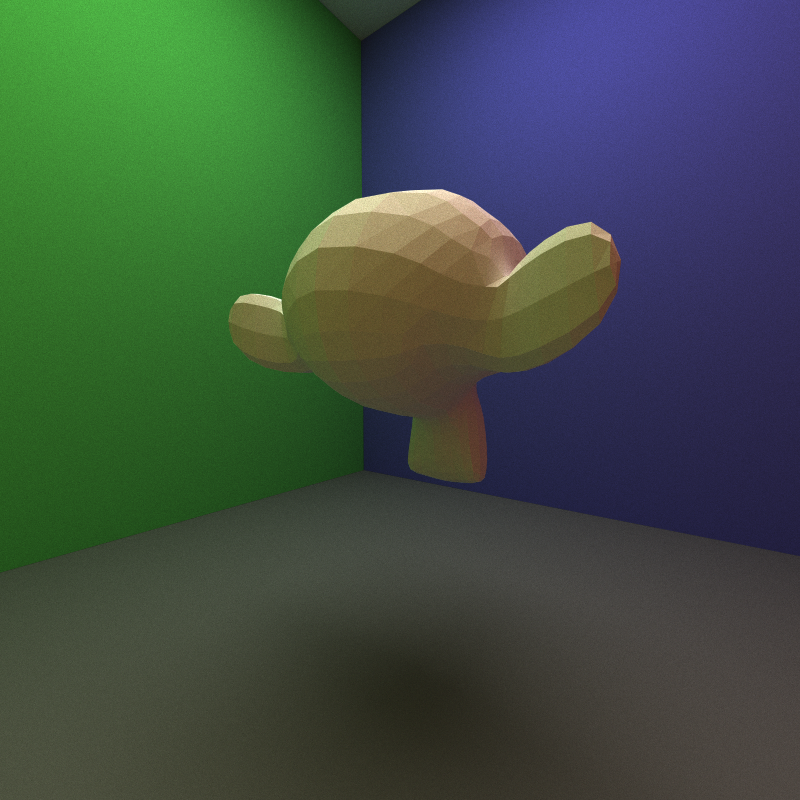
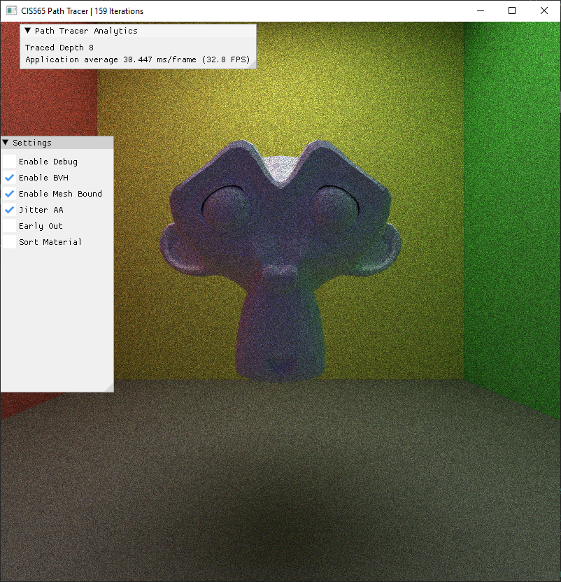

CUDA Path Tracer
================

**University of Pennsylvania, CIS 565: GPU Programming and Architecture, Project 3**

- Zhanbo Lin
    - [LinkedIn](https://www.linkedin.com/in/zhanbo-lin)
- Tested on: Windows 10, i5-10400F @ 2.90GHz 48GB, RTX-3080 10GB (Personal) 
- GPU Compute Capability: 8.6

## Renders ##

## Project Description ##
In this project, I implemented a GPU-based path tracer using CUDA.

## Usage
### Initialization
- To load a json scene: -j SCENEFILE.json

- To load a gltf model, it needs to load a defualt scene to properly initialize: -ld JSONSCENE.json -g GLTFMODEL.gltf 

### Camera Control

- Press W, A, S, D to move horizontally, Q and E to move vertically.

- Press middle mouse button to change movement speed.

- Hold right mouse button to adjust yaw and pitch.

### Other
- Press P to save current render to disk.

## Features 

### Shading kernel with BSDF evaluation (diffuse, perfect specular surfaces)

## Visual Improvements

### Arbitrary mesh import using gltf

### Stochastic Sampled Antialiasing + Stratified Sampling

Randomly jitter ray samples within each pixel to alleviate aliasing.

   Jitter disabled      |   Jitter enabled 
:-------------------------:|:-------------------------:
  | 

## Performance Improvements

### BVH Acceleration
BVH enabled (25.4 FPS)           |  Naive per triangle intersection (3.5 FPS)
:-------------------------:|:-------------------------:
 | 

### Material Sorting

It actually slows the render when enabled, might work better if we have more materials.
Material sorting disabled (32.8 FPS)         |   Material sorting enabled (14.8 FPS)
:-------------------------:|:-------------------------:
  |   

### Early-Out for Missed or Light Intersections

It also actually slows the render when enabled, might work better in an opened scene.

Early-out disabled (43 FPS)     | Early-out enabled  (35.1FPS)
:-------------------------:|:-------------------------:
   |  

