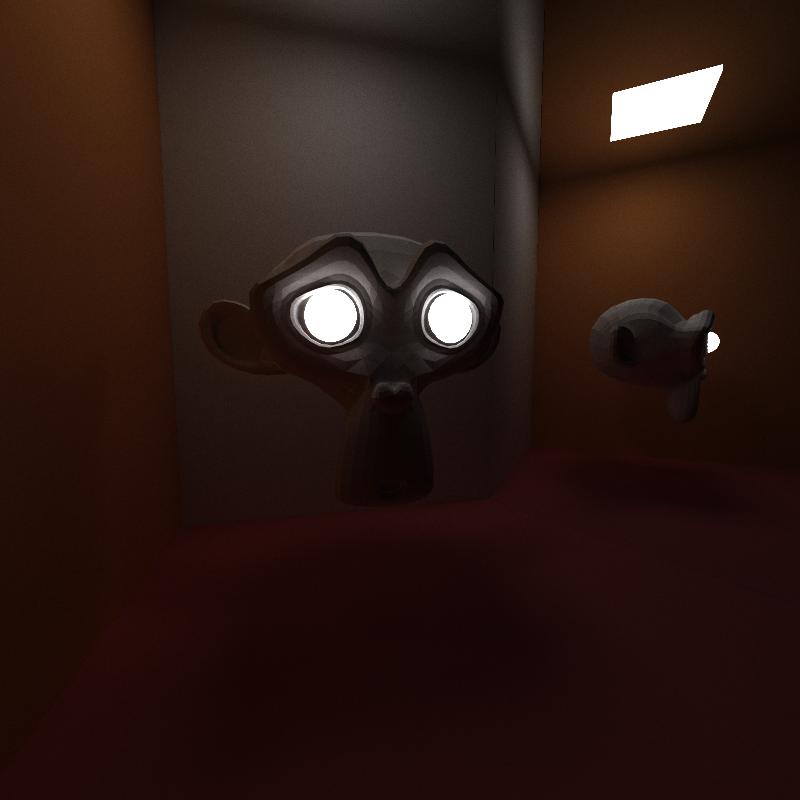
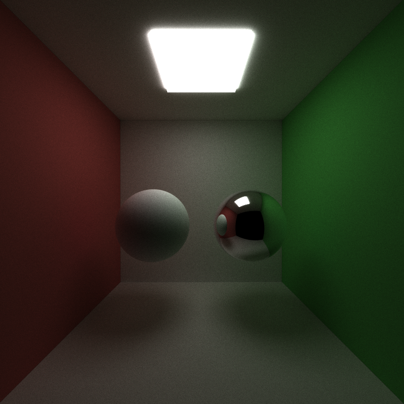
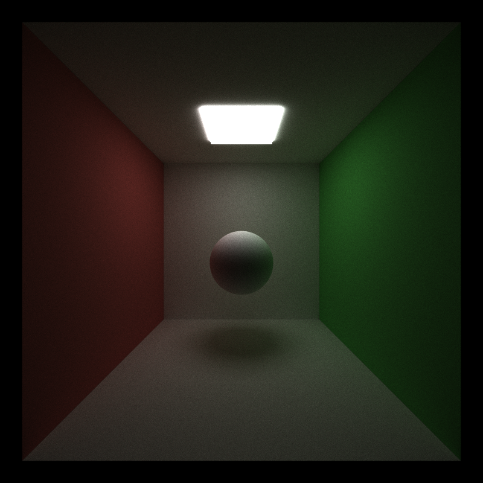
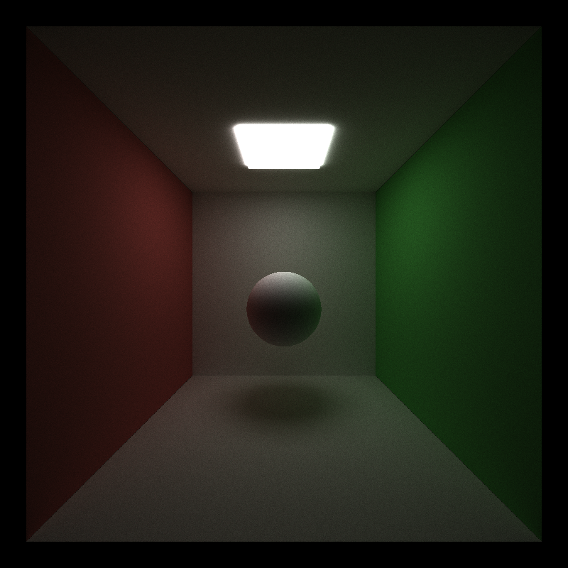
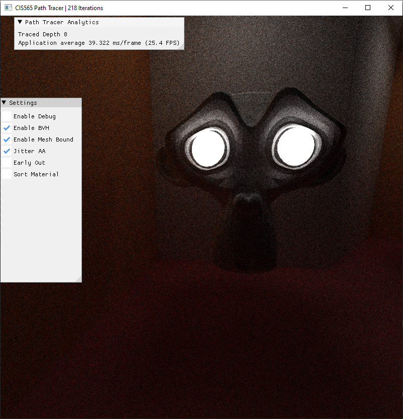
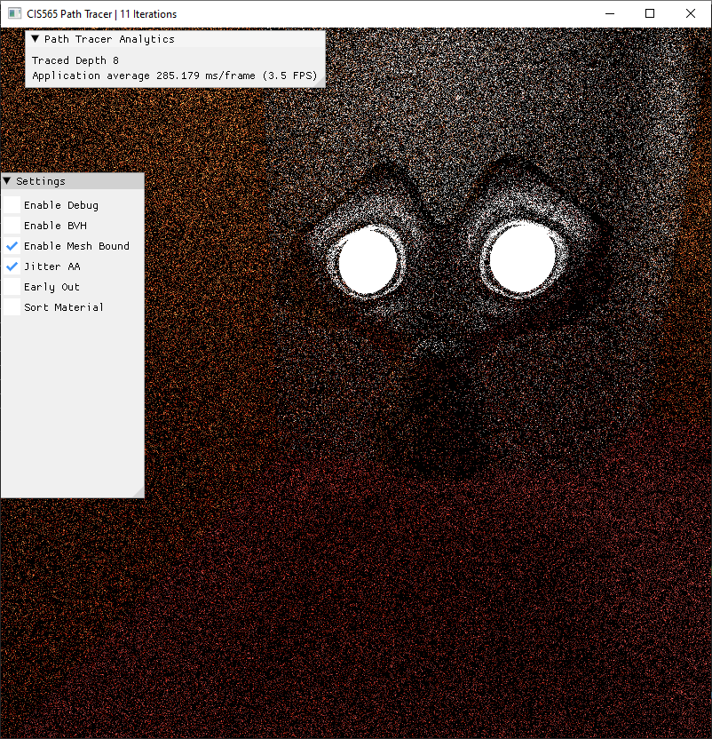
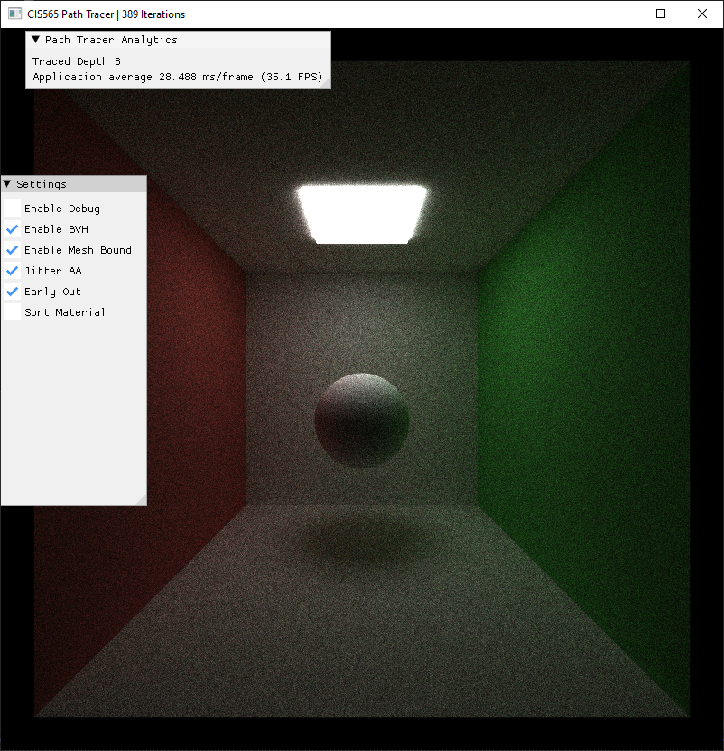

CUDA Path Tracer
================

**University of Pennsylvania, CIS 565: GPU Programming and Architecture, Project 3**

- Zhanbo Lin
    - [LinkedIn](https://www.linkedin.com/in/zhanbo-lin)
- Tested on: Windows 10, i5-10400F @ 2.90GHz 48GB, RTX-3080 10GB (Personal) 
- GPU Compute Capability: 8.6

## Renders ##

## Project Description ##

## Features 

<!--
List of core features completed https://github.com/CIS5650-Fall-2025/Project3-CUDA-Path-Tracer/blob/main/INSTRUCTION.md#part-1---core-features
-->
### Shading kernel with BSDF evaluation (diffuse, perfect specular surfaces)

### Visual Improvements
**Stochastic Sampled Antialiasing + Stratified Sampling**

Jitter enabled 

Jitter disabled 

**Arbitrary mesh import using gltf**

### Performance Improvements

**BVH Acceleration**

 bvh enabled 

 naive mesh iterative triangle intersection  

Direct Mesh Render
With BVH

**Material Sorting**

It actually slows the render when enabled, might work better if we have more materials.

**Early-Out for Missed or Light Intersections**

It also actually slows the render when enabled, might work better in an opened scene.

### Bloopers
